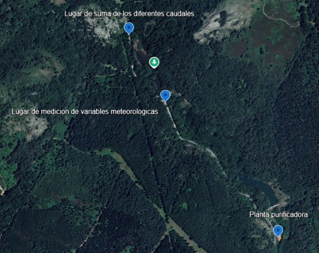

# AI-Based Water Quality Prediction for the Gorbea Water Treatment Plant

**Technical portfolio project based on an industrial AI case study.**

> This repository presents the project as a technical portfolio case study rather than as a direct copy of the original academic thesis.

## Language versions

* **English documentation:** [`docs/en/README.md`](docs/en/README.md)
* **Versión en castellano:** [`docs/es/README.md`](docs/es/README.md)

---

## Project overview

Water treatment plants must respond quickly to sudden turbidity spikes, especially during intense rainfall events. In Gorbea's water treatment plant, these episodes can increase operational risk, force coagulant overdosing, and reduce process stability.

This project explores how artificial intelligence can support **proactive water quality management** by predicting turbidity from historical plant operation data and meteorological variables.

Instead of focusing only on training a single model, the project was framed as a **reusable methodology** for designing, validating, and preparing the deployment of AI-based water quality prediction systems in real industrial environments.

<p align="center">
  
</p>
<p align="center"><em>Figure. Aerial view of the Gorbea water treatment infrastructure.</em></p>

### Core idea

Build and validate a methodological framework for turbidity prediction in a real water treatment context, using SCADA data, weather variables, and deep learning models for different forecasting horizons.

---

## Why this project matters

From a portfolio perspective, this project is valuable because it combines:

* **A real industrial problem** with operational impact
* **Time-series forecasting** in a critical infrastructure context
* **Data integration** from heterogeneous sources
* **Model comparison** across multiple neural network architectures
* **Prototype validation** with a realistic deployment mindset
* **Decision-support focus**, not just offline experimentation

---

## What was done

The work covered the following technical blocks:

* Definition of a **systematic AI methodology** for water quality prediction
* Integration of **SCADA operational data** and **meteorological variables**
* Comparative evaluation of five model families:

  * MLP
  * LSTM
  * GRU
  * TCN
  * Temporal Fusion Transformer (TFT)
* Prediction experiments for **1 h, 3 h, and 6 h horizons**
* Validation of a **functional prototype** for a potential pilot deployment
* Analysis of operational usefulness, deployment constraints, and future scalability

---

## Main outcome

The project showed that model performance strongly depends on the forecasting horizon.

* For **short-term prediction**, simpler recurrent approaches can already provide useful situational awareness.
* For **longer horizons**, more advanced architectures become significantly more valuable.
* In this case study, the **Temporal Fusion Transformer (TFT)** achieved the best overall behavior for longer-range proactive prediction, while **LSTM** offered a strong balance between reliability and implementation simplicity for an initial pilot-oriented setup.

---

## Technologies and concepts involved

* Python
* Time-series forecasting
* Deep learning
* SCADA data integration
* Meteorological data fusion
* MLP / LSTM / GRU / TCN / TFT
* Model evaluation with regression metrics
* Prototype validation
* Industrial AI / applied machine learning

---

## Repository guide

This repository is organized as a portfolio project with separate documentation in English and Spanish.

```text
.
├── README.md
├── assets/
│   └── images/
├── docs/
│   ├── en/
│   │   ├── README.md
│   │   ├── project-overview.md
│   │   ├── context-and-problem.md
│   │   ├── methodology.md
│   │   ├── data-pipeline.md
│   │   ├── modeling.md
│   │   ├── system-architecture.md
│   │   ├── deployment-and-monitoring.md
│   │   ├── results.md
│   │   └── lessons-learned.md
│   └── es/
│       ├── README.md
│       ├── descripcion-del-proyecto.md
│       ├── contexto-y-problema.md
│       ├── metodologia.md
│       ├── proceso-de-datos.md
│       ├── modelado.md
│       ├── arquitectura-del-sistema.md
│       ├── implementacion-y-monitorizacion.md
│       ├── resultados.md
│       └── lecciones-aprendidas.md
```

---

## Recommended reading path

If you are reviewing this repository as a recruiter, engineer, or collaborator, the best path is:

1. [`docs/en/README.md`](docs/en/README.md) or [`docs/es/README.md`](docs/es/README.md)
2. `project-overview.md`
3. `system-architecture.md`
4. `data-pipeline.md`
5. `modeling.md`
6. `results.md`

---

## Scope note

This repository is designed as a **technical showcase** of the project.

For confidentiality and portfolio clarity:

* the repository prioritizes **methodology, architecture, modeling logic, and results interpretation**
* it does **not aim to reproduce the original thesis document chapter by chapter**
* sensitive industrial data and production-specific assets are not expected to be fully exposed here

---

## Spanish summary

Este repositorio presenta el proyecto como un **caso técnico de portfolio**, no como una copia literal del TFM.

El objetivo fue desarrollar y validar una **metodología basada en IA para predecir la turbidez** en la planta purificadora de Gorbea (AMVISA), integrando datos operativos del SCADA con variables meteorológicas y comparando distintas arquitecturas de redes neuronales para horizontes de predicción de 1, 3 y 6 horas.

Además del rendimiento de los modelos, el foco del proyecto está en su **viabilidad industrial**, su posible despliegue piloto y su valor como herramienta de apoyo a la toma de decisiones operativas.

---

## Status

Documentation in progress. This repository is being gradually structured as a bilingual technical portfolio project.

---

## Author

**Jon Gomez Olarte**
Mechanical Engineer | AI-focused technical portfolio
